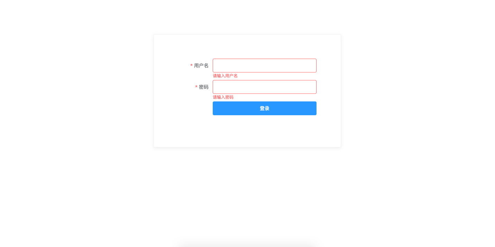
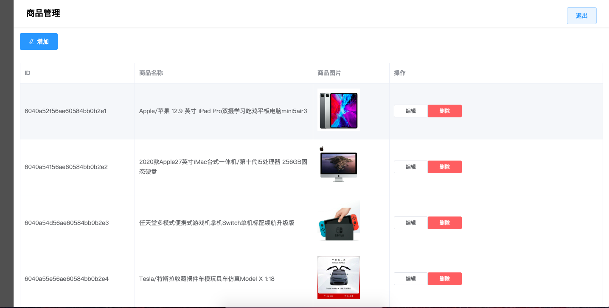
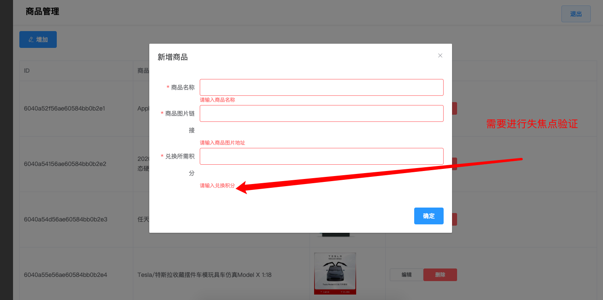
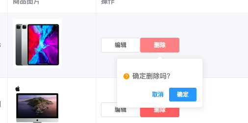
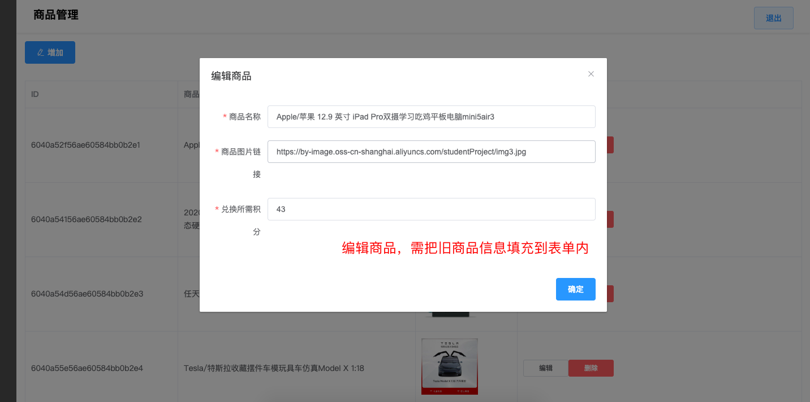

#### 项目要求


* 接口地址

```
http://49.235.98.65:3000/swagger
```


* 页面

```
1. 登录页面: 
2. 管理页面:
```


# 登录页





#### 登录页要求

* 需要失焦验证
* 登录成功后跳转到管理页面


这里需要存储下用户id，用于请求接口时 验证身份信息，

前后台两个项目验证方式都为，在请求头中，加入一个 { user: userid} 的形式


# 管理页





#### 管理页要求

* 增加商品
	* 商品名：  string
	* 商品图片： string 图片地址
	* 兑换所需积分：  number
* 删除商品： 需二次确认，可自定义弹框，可使用任何ui组件内的弹框
* 编辑商品：
	* 编辑时需把旧信息填充到页面上
* 退出： 清空登录信息后退回到登录页面


其他几个状态图











