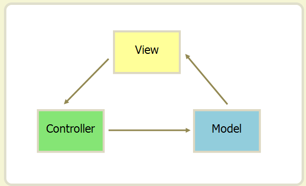

#### Vue是一套用于构建用户界面的  *渐进式*   js 框架

Document.getElementById("id")

$("#id")

gitHub  Star Num：angular70.8k，react164k，vue 180k

js    vs     jquery

js    vs    vue

#### MVC： （Model、View、Controller）

​		Model： 数据处理

​		View：负责视图 页面显示

​		Controller：逻辑处理

* 单向数据流

#### MVVM：（Model - View - ViewModel）

​		Model： 负责数据

​		View：负责视图 页面显示

​		ViewModel：监听者，双向监听  模型和视图之间的交互         Object.defineProperty()，虚拟DOM  

 * 双向数据流：

	

* MVVM 要解决的一个问题是将业务逻辑代码与视图代码完全分离，使各自的职责更加清晰
* MVVM与MVC最大的区别就是：它实现了View和Model的自动同步，也就是当Model的属性改变时，我们不用再自己手动操作Dom元素，来改变View，而是改变属性后该属性对应View层显示会自动改变。非常的神奇~

1. 双向数据绑定
2. 组件化~~~

3. 单页面

### Vue特点:

1. ##### 市场需求大：

2. ##### 渐进式框架：

3. ##### 学习成本小：语法简单：文档比较全，基于HTML的模板语法更友好

4. ##### 组建化开发，提⾼开发效率

5. ##### 数据驱动：  MVVM~~~

##### 

面试题1：谈谈你对mvvm的理解

### 文档

Vue.js

* * * *