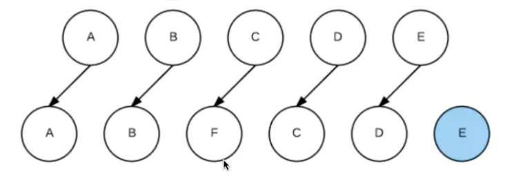

引入vue包

```
<script src="https://cdn.jsdelivr.net/npm/vue/dist/vue.js" type="text/javascript"></script>
```


生成Vue实例

```
var vm = new Vue({

})
```


把Vue实例绑定到根节点上

```
<div id="app">
	#app里相当于一个作用域，只在这个元素里面 才能用vue写法
</div>

var vm = new Vue({
	el: "#app"
})
```


* v-text

```
v-text=""
```


* v-html

```
v-html="htmlData"

htmlData: '<ul><li>第一条：不能抽烟</li><li>第二条：不能喝酒</li></ul>'
```


* 条件表达式

```
v-if=""
v-else-if=""
v-else-if=""
v-else-if=""
v-else
```


* v-show

```
<div v-show=""></div>
```

注意：V-if 与 v-show 的区别

v-if 的时候元素会被销毁掉，再次显示出来的时候回重新创建DOM元素

v-show 的时候 元素不会被清理掉，只是通过display：none 将其暂时隐藏


* v-for

```
v-for="item in list"
v-for="(item, index) in list"     item.name   item.age
```

注意： v-if 尽量不要与 v-for 一起使用，v-for优先级 高于v-if


* v-bind

```

动态地绑定一个或多个属性，或一个组件

正常写法    v-bind:src=""
简略写法    :src=""

```


* key

```
一个插入的例子
<template>
  <div>
    <p v-for="item in list" :key="item.id">{{ item.name }}</p>
  </div>
</template>

<script>
export default {
  name: 'Setting',
  data () {
    return {
      list: [
        {name: 'a', id: 1},
        {name: 'b', id: 2},
        {name: 'c', id: 3},
        {name: 'd', id: 4},
        {name: 'e', id: 5}
      ]
    }
  },
  mounted() {
    setTimeout(()=>{
      this.list.splice(2, 0, {name: 'f'});
    }, 2000)
  },
}
</script>
```


上面案例重现的是以下过程


不使用key的情况

```
old： A B C D E
new： A B F C D E


A更新成A（节点一样不会发生更新）
B更新成B（节点一样不会发生更新）
C更新成F
D更新成C
E更新成D
插入E
```

..




使用key


```
首次循环 patch A
A B C D E
A B F C D E


第2次循环 patch B
B C D E
B F C D E


第3次循环 patch E
C D E
F C D E

第4次循环 patch D
C D
F C D

第5次循环 patch C
C
F C

第6次
增加F节点
```


浏览器调试看下执行过程

```
while (oldStartIdx <= oldEndIdx && newStartIdx <= newEndIdx)

oldStartVnode.tag==='tagName'
```


* class+style

```
html的形式：     <div class="div1"></div>
vue原始写法			 <div v-bind:class="'div1'"></div>
vue单个					<div :class="'div1'"></div>
vue多个					<div :class="[ 'div1', is1? '':'div2']"></div>

html:    <div style="color: red;"></div>
vue单个:     <div :style="color: 'red'"></div>
vue多个:     <div :style="color: 'red', width: isTrue? '100px': '200px'"></div>
```


* v-model

```
<input type="text" v-model="inputValue">

/** v-model 可以绑定的标签 */
input
select
textarea
```


作业要求：

* 双城for循环显示成绩单
* 单双行设置不一样的背景颜色
* 前三名显示不一样的图标

|          姓名          | 数学 | 语文 | 英语 | 历史 | 地理 | 总分 |
| :--------------------: | :--: | :--: | :--: | :--: | :--: | :--: |
|   （第一名图标）张三   |  99  |  78  |  90  |  80  |  89  | 436  |
|   （第二名图标）李四   |  89  |  55  |  79  |  99  |  78  | 400  |
| （第三名图标）王二麻子 |  79  |  33  |  60  |  89  |  80  | 341  |
|         大冬瓜         |  68  |  24  |  66  |  50  |  45  | 253  |

